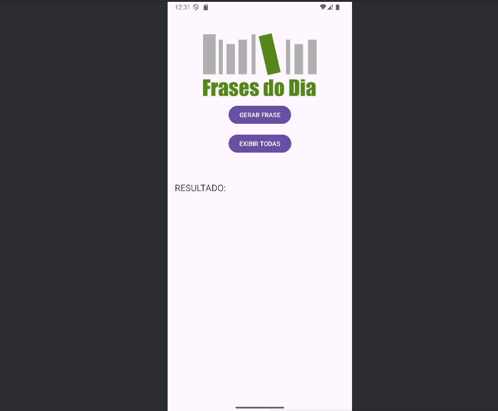

# App Frases Aleatórias

Um aplicativo Android simples em **Java** que exibe frases aleatórias para inspirar, motivar ou divertir o usuário.

---

## 📌 Sobre o projeto

Este projeto tem como objetivo criar um app leve para dispositivos Android que mostra **frases aleatórias** sempre que o usuário quiser.  
É ideal como exercício para aprender integração de UI, lógica de aleatoriedade, persistência (se desejar), e publicação no GitHub.


---

## ✅ Funcionalidades (versão atual)

- Tela inicial com uma frase aleatória ao abrir o app  
- Botão para gerar nova frase  
- Layout simples e intuitivo  
- Projeto todo em Java

---

## 🛠️ Tecnologias & Ferramentas

- Linguagem: **Java**  
- Plataforma: Android  
- IDE: Android Studio  
- Controle de versão: Git + GitHub  
- Arquitetura simples (sem frameworks complexos)

---

## 📂 Estrutura do repositório

```text
/
├── app/  
│   ├── src/  
│   └── …  
├── .gitignore  
├── build.gradle  
├── settings.gradle  
└── README.md
O diretório app/src/ contém código fonte (layouts XML, atividades Java etc.)

.gitignore evita versionar arquivos desnecessários (build, arquivos temporários, etc.)

Os arquivos Gradle (build.gradle, settings.gradle) cuidam da configuração do projeto

🚀 Como executar o projeto localmente
Clone este repositório:

bash
Copiar código
git clone https://github.com/RafaelaDesousa33/App-Frases-aleatorias.git


